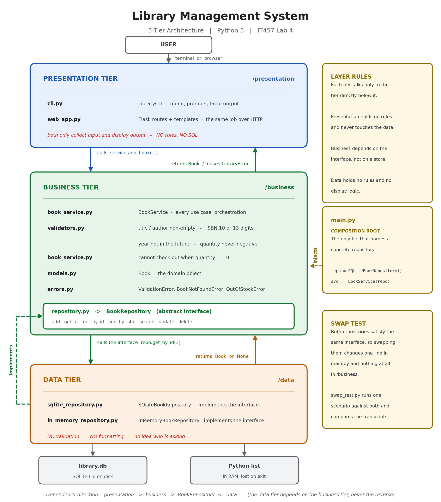

# Library Management System — A 3-Tier Application

A small book-collection manager built to demonstrate strict separation between a
**Presentation**, a **Business Logic**, and a **Data Access** tier.

Written in Python 3. It ships with **two** presentation tiers — a command-line
menu and a Flask web UI — that share one business tier and one data tier, which is
the clearest evidence that no business logic leaked upward into the UI.

---

## How to run

Requires Python 3.9 or newer (developed on 3.12).

### The web UI

```bash
pip install -r requirements.txt     # Flask, the only dependency
python main.py --ui web
```

Then open **http://127.0.0.1:5000** in a browser. The page lists every book, with
a search box, an *Add a book* button, and Check out / Edit / Delete on each row.
Press Ctrl+C in the terminal to stop the server.

```bash
python main.py --ui web --port 8000        # different port
python main.py --ui web --store memory     # web UI on the in-memory data layer
```

### The CLI

No installation needed — the CLI, both data layers and all the tests are pure
standard library.

```bash
python main.py                  # CLI against SQLite (creates library.db)
python main.py --store memory   # CLI against the in-memory data layer
python main.py --db mybooks.db  # different database file
```

Then pick options from the menu:

```
========== LIBRARY MANAGEMENT ==========
1. Add a book
2. View all books
3. Search books (title or author)
4. Update a book
5. Delete a book
6. Check out a book
0. Exit
========================================
```

### Run the unit tests

```bash
python -m unittest discover -s tests -t . -v
```

25 tests, all of which run against a fake in-test repository — no database file is
created or touched.

### Run the swap test

```bash
python swap_test.py
```

---

## Project layout

```
lab4/
├── presentation/          PRESENTATION TIER
│   ├── cli.py             menu, prompts, table formatting, error display
│   ├── web_app.py         Flask routes — the same job, over HTTP
│   ├── templates/         base.html, index.html, form.html
│   └── static/style.css
├── business/              BUSINESS TIER
│   ├── book_service.py    every use case: add, list, search, update, delete, check out
│   ├── validators.py      the business rules as pure functions
│   ├── repository.py      BookRepository — the abstract interface the service depends on
│   ├── models.py          the Book domain object
│   └── errors.py          ValidationError, BookNotFoundError, OutOfStockError, ...
├── data/                  DATA TIER
│   ├── sqlite_repository.py     SQLiteBookRepository
│   └── in_memory_repository.py  InMemoryBookRepository
├── tests/
│   ├── fake_repository.py       the fake data source used by the tests
│   ├── test_book_service.py     25 business-logic tests
│   └── test_swap.py             swap test as a unittest
├── main.py                composition root — picks the data layer, wires the tiers
├── swap_test.py           runnable proof that both data layers behave identically
├── generate_diagram.py    renders architecture.png
├── architecture.png       the architecture diagram
├── requirements.txt       Flask (needed only for the web UI)
└── ARCHITECTURE.md        the same diagram in ASCII, plus a request walkthrough
```

---

## What each tier does

### Presentation tier — `/presentation`

Input and output only, in two interchangeable forms:

- **`cli.py`** — `LibraryCLI` prints the menu, reads raw strings, hands them to
  `BookService`, and formats the result as a table.
- **`web_app.py`** — Flask routes do the identical job over HTTP: read
  `request.form`, call `BookService`, render a Jinja template.

When the business tier raises a `LibraryError`, the CLI prints it with a `!!`
prefix and the web UI shows it as a red flash message. Neither decides *what* is
an error, only *how to display* one.

Both import `BookService`, `Book`, and `LibraryError`. Neither imports `sqlite3`,
neither knows a database exists, and neither contains a single validation rule.

One detail worth pointing out in `web_app.py`: the HTML forms deliberately carry
**no** `required`, `type="number"`, `min` or `pattern` attributes. Those would make
the browser enforce business rules, which would put validation in the presentation
tier. Every field is posted as a plain string and the business tier alone decides
whether it is acceptable — which is why submitting a blank title or a year of 3000
in the browser produces the same error message the CLI gives.

### Business tier — `/business`

The only place where rules live:

| Rule | Where it is enforced |
|---|---|
| Title cannot be empty | `validators.validate_title` |
| Author cannot be empty | `validators.validate_author` |
| ISBN must be exactly 10 or 13 digits | `validators.validate_isbn` |
| Publication year must not be in the future | `validators.validate_year` |
| Quantity cannot be negative | `validators.validate_quantity` |
| Cannot check out when quantity is 0 | `BookService.check_out_book` |
| ISBN must be unique in the collection | `BookService.add_book` / `update_book` |

`BookService` receives a `BookRepository` in its constructor and calls only the
seven methods that interface declares. `grep -r sqlite business/` returns nothing.

### Data tier — `/data`

Two interchangeable implementations of `BookRepository`. They translate between
`Book` objects and storage rows, and do nothing else — no validation, no
formatting, no knowledge of who is asking. If you hand `SQLiteBookRepository` a
book with an empty title and a year of 3000, it will store it happily; keeping
that from happening is the business tier's job, not its own.

---

## Design decision

**I defined the `BookRepository` interface inside the business tier rather than the
data tier, and injected the concrete implementation through the `BookService`
constructor.** The obvious alternative was to let `BookService` import
`SQLiteBookRepository` directly and construct it internally — fewer files, less
ceremony. I rejected it because it points the dependency arrow the wrong way: the
business rules would then depend on a storage detail, and any change to the
database would ripple upward into logic that has nothing to do with storage. By
having the business tier *declare* what it needs (`add`, `get_by_id`, `search`,
`update`, `delete`, …) and letting `/data` supply classes that satisfy that
contract, the dependency points inward instead. Three concrete benefits fell out of
this: the unit tests run against a `FakeBookRepository` dictionary and never touch
a file, so the whole suite finishes in under a tenth of a second; the swap between
SQLite and an in-memory list is a one-line change in `main.py` with zero edits to
`/business`; and `main.py` becomes the single composition root, the only file in
the project allowed to know which storage technology is actually in use.

---

## Swap test — proving the data layer is interchangeable

`swap_test.py` runs one scenario — add three books, search by title, search by
author, update a book, check one out, attempt a checkout at quantity 0, submit an
invalid book, delete a book, list what remains — first against
`InMemoryBookRepository`, then against `SQLiteBookRepository`. Both runs call the
exact same `run_scenario(service)` function; the *only* difference is which
repository was passed into `BookService`.

```bash
$ python swap_test.py

STEP                       IN-MEMORY                                SQLITE
----------------------------------------------------------------------------------------
count after adds           3                                        3
search 'dune'              ['Dune', 'Dune Messiah']                 ['Dune', 'Dune Messiah']
search 'gibson'            ['Neuromancer']                          ['Neuromancer']
updated title              Dune (Deluxe Edition)                    Dune (Deluxe Edition)
quantity after checkout    0                                        0
checkout at zero           OutOfStockError                          OutOfStockError
invalid book               ValidationError                          ValidationError
count after delete         2                                        2
remaining titles           ['Dune Messiah', 'Neuromancer']          ['Dune Messiah', 'Neuromancer']

PASS: both data layers produced identical results.
The business tier was not modified between the two runs.
```

The swap in `main.py` is literally this:

```python
repository = InMemoryBookRepository()          # or
repository = SQLiteBookRepository("library.db")
service = BookService(repository)              # unchanged either way
```

No file under `/business` differs between the two runs.

---

## Two presentation tiers, one business tier

The same separation that lets the data layer be swapped also lets the *UI* be
swapped. `cli.py` and `web_app.py` are completely independent — one is a terminal
menu, the other is HTTP and HTML — yet neither contains a rule, and both produce
identical behaviour because both delegate to the same `BookService`:

| Action | CLI | Web |
|---|---|---|
| Blank title | `!! Title cannot be empty.` | red flash: *Title cannot be empty.* |
| ISBN `123` | `!! ISBN must be exactly 10 or 13 digits.` | same message |
| Check out at qty 0 | `!! '...' is out of stock ...` | same message |
| Unknown id | `!! No book found with id 99.` | same message |

Because the two UIs and the two data layers are independent, all four combinations
work: `--ui cli --store sqlite`, `--ui cli --store memory`, `--ui web --store
sqlite`, `--ui web --store memory`. Nothing in `/business` changes for any of them.

## Test coverage summary

All tests use `tests/fake_repository.py`, a dictionary-backed `BookRepository`. No
test opens a database connection except `test_swap.py`, whose entire purpose is to
compare the two storage backends (and even that one writes to a throwaway temp
file, never `library.db`).

| Test group | What it covers |
|---|---|
| `TestAddBook` | valid add, whitespace trimming, empty title, empty author, bad ISBN lengths, future year, negative quantity, duplicate ISBN, and that an invalid book never reaches the data layer |
| `TestSearchAndRead` | list all, partial title match, partial author match, case-insensitivity, empty search term, unknown id |
| `TestUpdateAndDelete` | partial field updates, invalid values rejected, ISBN collision, unknown id, delete, delete unknown id |
| `TestCheckOut` | quantity decreases by 1, `OutOfStockError` at 0, quantity never drops below 0, unknown id |
| `TestDataLayerSwap` | both repositories produce byte-identical transcripts |

One test is worth calling out: `test_invalid_book_is_never_written_to_the_data_layer`
asserts that after a failed validation the fake repository's call log contains no
`add` — proof that validation happens *before* the data tier is reached, not inside it.

## Architecture diagram



The same diagram in ASCII form is in [ARCHITECTURE.md](ARCHITECTURE.md), which also
traces a single request ("check out book 3") through all three tiers.

The PNG is generated from code, so it can be regenerated after any change:

```bash
python generate_diagram.py     # writes architecture.png
```
